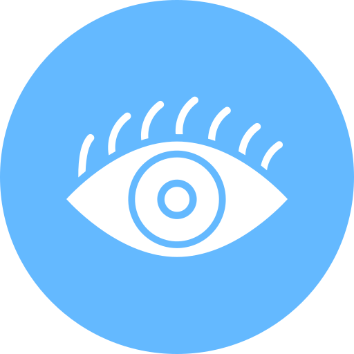

# Biblioteca Thundera

<h1 align="center">
    
</h1>

<div align="center">
    <h3> 🔵 Biblioteca que ajuda desenvolvedores a construírem aplicações web acessíveis para pessoas com deficiência visual. 🔵 </h3>
    <a href="https://github.com/PedroCantanhede" target="_blank">
      
    </a>
     
    
    
</div>

---

## **Índice**

1. [Introdução](#introdução)
2. [Documentação das Libraries](#documentação-das-libraries)
3. [Componentes](#componentes)
   - [AccessibleAlert](#accessiblealert)
   - [AccessibleModal](#accessiblemodal)
   - [AccessibleCard](#accessiblecard)
   - [AccessibleDialog](#accessibledialog)
   - [AccessibleList](#accessiblelist)
   - [AccessibleTooltip](#accessibletooltip)
   - [AccessibleForm](#accessibleform)
   - [AnnouncedButton](#announcedbutton)
   - [SkipToButton](#skiptobutton)
   - [AccessibleTabs](#accessibletabs)
4. [Ferramenta de Auditoria de Acessibilidade](#ferramenta-de-auditoria-de-acessibilidade)
5. [Contribuição e Suporte](#contribuição-e-suporte)

---

## **Introdução**

A biblioteca **Thundera** reúne as melhores práticas e ferramentas da comunidade Vue para facilitar o desenvolvimento de aplicações acessíveis. Todas as ferramentas necessárias estão integradas diretamente na sua instalação.

---

## **Documentação das Libraries**

### **Vue Announcer**
**Link da Documentação**: [Vue Announcer](https://github.com/vue-a11y/vue-announcer)

**O que faz?**
Gerencia mensagens dinâmicas e as envia para leitores de tela.

**Como usar?**
```javascript
import { useAnnouncer } from '@vue-a11y/announcer';

const { announce } = useAnnouncer();
announce('Mensagem anunciada para o leitor de tela');
```

### **AccessibleTabs**
**Link da Documentação**: [AccessibleTabs](https://www.npmjs.com/package/vue3-accessible-tabs)

**O que faz?**
Cria abas acessíveis seguindo as melhores práticas do WAI-ARIA.

### **Vue Final Modal**
**Link da Documentação**: [Vue Final Modal](https://vue-final-modal.org/)

**O que faz?**
Cria modais acessíveis e configuráveis para aplicações Vue.

### **Focus Lock**
**Link da Documentação**: [Focus Lock](https://github.com/theKashey/vue-focus-lock)

**O que faz?**
Mantém o foco confinado dentro de elementos, como modais.

### **Form Kit**
**Link da Documentação**: [Form Kit](https://formkit.com/)

**O que faz?**
Facilita a criação de formulários acessíveis e dinâmicos.

### **Skip To**
**Link da Documentação**: [Skip To](https://github.com/vue-a11y/vue-skip-to)

**O que faz?**
Permite criar links para saltar diretamente ao conteúdo principal ou outras seções importantes.

### **Sr Only**
**Link da Documentação**: [Sr Only](https://bootstrap-vue.org/docs/reference/accessibility)

**O que faz?**
Cria elementos visíveis apenas para leitores de tela.

---

## **Componentes**

### **AccessibleAlert**
- **Descrição**: Componente de alerta acessível.
- **Exemplo de Uso**:
```vue
<AccessibleAlert
  v-model:visible="showAlert"
  title="Sucesso!"
  description="Sua operação foi concluída com êxito."
  :autoDismiss="true"
  :dismissTimeout="5000"
/>
```

### **AccessibleModal**
- **Descrição**: Modal acessível com foco confinado.
- **Exemplo de Uso**:
```vue
<AccessibleModal
  v-model:isVisible="showModal"
  title="Exemplo de Modal"
  description="Conteúdo acessível com foco confinado."
/>
```

### **AccessibleCard**
- **Descrição**: Cartão acessível com suporte para mensagens dinâmicas.
- **Exemplo de Uso**:
```vue
<AccessibleCard
  :focusLock="false"
  announceMessage="Interagiu com o cartão."
>
  <template #title>Produto</template>
  <template #description>Descrição do produto.</template>
</AccessibleCard>
```

### **AccessibleDialog**
- **Descrição**: Diálogo acessível com suporte a leitores de tela.
- **Exemplo de Uso**:
```vue
<AccessibleDialog
  v-model:isVisible="showDialog"
  title="Exemplo de Diálogo"
  openMessage="O diálogo foi aberto."
  closeMessage="O diálogo foi fechado."
/>
```

### **AccessibleList**
- **Descrição**: Lista acessível com navegação por teclado.
- **Exemplo de Uso**:
```vue
<AccessibleList
  :items="['Item 1', 'Item 2', 'Item 3']"
  initialIndex="0"
  @item-selected="handleItemSelected"
/>
```

### **AccessibleTooltip**
- **Descrição**: Tooltip acessível para leitores de tela.
- **Exemplo de Uso**:
```vue
<AccessibleTooltip content="Tooltip informativo!">
  <template #icon>
    <i class="material-icons">info</i>
  </template>
</AccessibleTooltip>
```

### **AccessibleForm**
- **Descrição**: Formulário acessível com validação dinâmica.
- **Exemplo de Uso**:
```vue
<AccessibleForm
  title="Cadastro"
  buttonText="Cadastrar"
  @submit="handleFormSubmit"
/>
```

### **AnnouncedButton**
- **Descrição**: Botão que emite mensagens dinâmicas para leitores de tela.
- **Exemplo de Uso**:
```vue
<AnnouncedButton
  label="Salvar"
  announcement="Os dados foram salvos com sucesso!"
/>
```

### **SkipToButton**
- **Descrição**: Botão para saltar diretamente ao conteúdo principal.
- **Exemplo de Uso**:
```vue
<SkipToButton target="#main-content" label="Ir para o conteúdo principal" />
```

### **AccessibleTabs**
- **Descrição**: Componente de abas acessíveis com navegação por teclado.
- **Exemplo de Uso**:
```vue
<AccessibleTabs
  :tabs="[
    { label: 'Tab 1', content: 'Conteúdo da Tab 1' },
    { label: 'Tab 2', content: 'Conteúdo da Tab 2' }
  ]"
/>
```

---

## **Ferramenta de Auditoria de Acessibilidade**

### **Vue Axe**
**Link da Documentação**: [Vue Axe](https://axe.vue-a11y.com/)

**O que faz?**
Ajuda a identificar e corrigir problemas de acessibilidade durante o desenvolvimento.

---

## **Contribuição e Suporte**

Contribuições são bem-vindas! Para suporte, entre em contato através do repositório oficial no GitHub.
